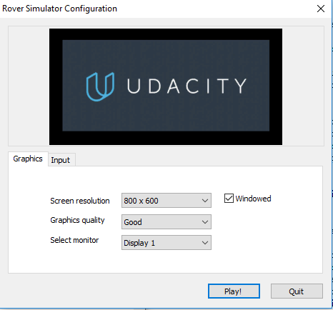
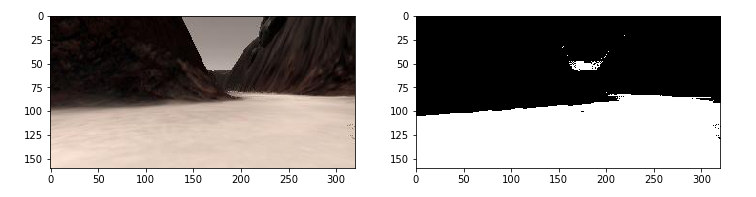
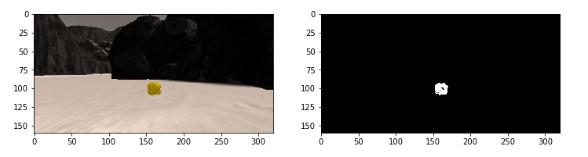

## Project: Search and Sample Return

### Outline
- Summary
- Videos
- Data Analysis
- - Obstacle, Navigable Terrain, and Rock Sample Identification
- - World Map Creation
-Autonomous Navigation and Mapping
- - Perception
- - Decision-making
-Known Issues and Recomondations for Improvement

# Summary
- I have used Computer Vision techniques to process the image coming from thr Rover.
- - Idetify Rock Samples
- - Mapping environment in real-time for autonomous driving.
- I have wrote python codes to make a decision pipeline which proposes what actions to take in order to navigate the environment autonomously and pick up desired samples.

> I chose an 800 x 600 resolution with the graphic quality of 'good' for autonomous navigation



# Videos
- [Notebook Analysis Output Video](https://github.com/ardakayaa/Robotics-SearchAndSampleReturn/blob/master/output/test_mapping.mp4)
- [Screen Recording](https://youtu.be/4edeJGg8uFY)

# Data Analysis
- [The notebook]
(https://github.com/ardakayaa/Robotics-SearchAndSampleReturn/blob/master/code/Rover_Project_Test_Notebook.ipynb)
- [Output video of this notebook]
(https://github.com/ardakayaa/Robotics-SearchAndSampleReturn/blob/master/output/test_mapping.mp4)

## Obstacle, Navigable Terrain, and Rock Sample Identification

- To get navigable Terrain I have used brownish color
- - To get more accurute results for steer direction, I  croped the half of the image that is coming from Rover. Result was better in narrow channels, but when the rover was in wide areas, it started turning same direction non-stop. So, I closed it. 

```python
def color_thresh(img, rgb_thresh=(160, 160, 160)):
        color_select = np.zeros_like(img[:,:,0])    	above_thresh = (img[:,:,0] > rgb_thresh[0]) \
                & (img[:,:,1] > rgb_thresh[1]) \
                & (img[:,:,2] > rgb_thresh[2])
    
    color_select[above_thresh] = 1 
   
    # Masks the half of the image 
    #color_select[0:85,0:320] = 0
    
    # Return the binary image
    return color_select
```

- To find Rock samples I have used yellowish color 
```python
def find_rocks(img, levels=(110, 110, 50)):

    rock_pix = (img[:,:,0] > levels[0]) \
                & (img[:,:,1] > levels[1]) \
                & (img[:,:,2] < levels[2])

    color_select = np.zeros_like(img[:,:,0])       
    color_select[rock_pix] = 1
    
    return color_select
    
rock_map = find_rocks(rock_img)
```


## World Map Creation

- Algorithmically, I did the following steps for world map creation:
- Initally: I started a a map which is a blank image.
- Repeatedly: Each time there is an incoming image:
- - 1. Use the color thresholding function to identify the Rock sample `find_rocks()` and navigable terrain `color_thresh()`
- - 2. Transform the perspective (using`perspect_transform()`)
- - 3. Convert these transformed perspective (_warped_) pixel locations to rover coordinates by using `rover_coords()`
- - 4. Convert these pixel locations to coordinates in the (_worldmap_) by scaling, rotating and translating (`def to_polar_coords()`,`def rotate_pix()`,`def translate_pix()`,`def pix_to_world()`)

# Autonomous Navigation and Mapping

## Perception
- [perception.py]
(https://github.com/ardakayaa/Robotics-SearchAndSampleReturn/blob/master/code/perception.py)

- Given a camera image from the rover my `perception_step()` function is roughly like this:

### 1.Identify pixel locations of navigable terrain, obtacles and samples
- To get pixel locations from Rover's cam, I used thresholding.





### 2.Process pixel locations of terrain, samples and obstacles 
- This includes following:
- - The `warped` and `obs_map` locations by transforming the perspective from _camera view_ to _sky view_
- - The  `rover pixels` location by converting the `warped` to the Rover coordinate space
- - The `polar pixels` which is the `rover pixels` in coordinate space.
- - These `polar pixels` are used to compute the `mean angle` that can be used as the angle of steering of the rover   
- - The `world pixels` transformed from the `rover pixels` in rover coordinate space to world map coordinate space

### 3.Update Rover Properties, World Map, and Rover Vision Image
- The `world pixels` locations are displayed as the robot's vision image, giving `warped`(terrain) and `rock_map`(sample) pixels their own respective unique identifying color.
- If there are any pixels in `rock_map` this means there is a perceived sample we should go to. Starts to record distance and angle information of sample in`Rover.samples_pos`.


## Decision-making
- [my_states.py]
(https://github.com/ardakayaa/Robotics-SearchAndSampleReturn/blob/master/code/my_states.py)
